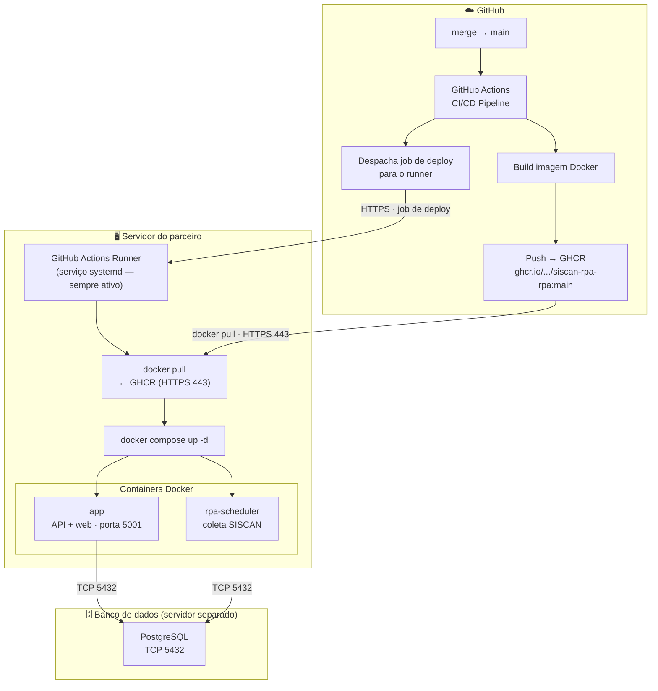

# Guia de Deploy — Modo Servidor (Ubuntu Server)
<a name="deploy-server"></a>

Versão: 1.0
Data: 2026-03-18

Deploy em Ubuntu Server com PostgreSQL externo. O deploy de novas versões é automático via GitHub Actions com self-hosted runner.

---

## Como funciona



**Fluxo resumido:**

1. **Merge para `main`** — um desenvolvedor da Prisma aprova e mescla uma alteração no repositório `siscan-rpa`. Esse evento dispara automaticamente o pipeline de CI/CD no GitHub Actions.

2. **Build e publicação da imagem** — o GitHub Actions compila o código, executa os testes e empacota tudo em uma imagem Docker. Essa imagem é publicada no GitHub Container Registry (GHCR) com a tag `main`, substituindo a versão anterior. O processo ocorre inteiramente na infraestrutura do GitHub — nada é enviado ao servidor do parceiro nesta etapa.

3. **Despacho do job de deploy** — após a publicação da imagem, o mesmo pipeline envia um job de deploy para o runner registrado no servidor do parceiro. Esse job chega via HTTPS e contém apenas instruções — não carrega código-fonte.

4. **Atualização local pelo runner** — o runner, rodando como serviço systemd no servidor, executa dois comandos em sequência:
   - `docker pull ghcr.io/prisma-consultoria/siscan-rpa-rpa:main` — baixa a nova imagem certificada do GHCR.
   - `docker compose -f docker-compose.prd.external-db.yml up -d` — recria os containers com a nova imagem. Containers em execução são substituídos com tempo de inatividade mínimo.

5. **Containers em operação** — `app` (API web, porta 5001) e `rpa-scheduler` (coleta automática do SISCAN) sobem com a versão atualizada e reconectam ao PostgreSQL externo via TCP na porta 5432. O banco de dados não é tocado pelo processo de deploy — apenas a camada de aplicação é substituída.

---

**Sobre tráfego de rede e segurança:**

O servidor do parceiro **nunca recebe código-fonte** — apenas a imagem pré-compilada e certificada, produzida e assinada pelo pipeline da Prisma. O único tráfego de **entrada** é o job de deploy enviado pelo GitHub via HTTPS (porta 443); todo o restante é tráfego de **saída** — o runner consulta o GitHub para receber jobs e o Docker baixa a imagem do GHCR. Não é necessário abrir nenhuma porta de entrada no firewall do servidor.

---

## Pré-requisitos

### Servidor de aplicação

| Requisito | Mínimo | Verificação |
|---|---|---|
| Sistema operacional | Ubuntu 24.04 LTS | `lsb_release -a` |
| vCPUs | 4 | `nproc` |
| Memória RAM | 8 GB | `free -h` |
| Disco — artefatos da aplicação | 200 GB (volume dedicado, ex.: `/app`) | `df -h /app` |
| Disco — Docker | 50 GB (volume dedicado, ex.: `/var/lib/docker`) | `df -h /var/lib/docker` |
| Docker Engine | ≥ 28.x (não Docker Desktop) | `docker version` — deve mostrar `Server: Docker Engine` |
| Docker Compose | ≥ 2.37 | `docker compose version` |
| git | qualquer versão recente | `git --version` |
| Conectividade de saída HTTPS | `github.com` e `ghcr.io` porta 443 | `curl -s -o /dev/null -w "%{http_code}" https://ghcr.io` deve retornar `200` ou `301` |

### Servidor de banco de dados (externo)

| Requisito | Mínimo |
|---|---|
| PostgreSQL | ≥ 16 |
| Conectividade TCP | Porta 5432 acessível pelo servidor de aplicação |

Verificar conectividade antes de prosseguir:

```bash
psql -h <DATABASE_HOST> -U siscan_rpa -c "SELECT version();"
```

### Token de registro do runner

Obter antes de executar o script: GitHub → repositório `siscan-rpa` → Settings → Actions → Runners → **New self-hosted runner** → copiar o token de registro.

---

## Instalação (`siscan-server-setup.sh`)

O script executa **uma única vez** de forma interativa. Execute:

```bash
git clone https://github.com/Prisma-Consultoria/assistente-siscan-rpa.git
cd assistente-siscan-rpa
bash ./siscan-server-setup.sh
```

O script percorre 8 fases em sequência — detalhadas na seção [Fases do script](#fases-do-script) abaixo.

---

## Fases do script

### Fase 1 — Verificação de pré-requisitos

Verifica se os seguintes componentes estão disponíveis e funcionando:

- **Docker Engine**: checa `docker info` (daemon rodando, usuário com acesso ao socket). Se falhar, o script diagnostica a causa — serviço parado, usuário fora do grupo `docker` ou socket ausente — e exibe o comando correto para resolver.
- **Docker Compose v2** (plugin): checa `docker compose version`.
- **curl**: necessário para baixar o runner.
- **sudo**: necessário para criar `/opt/siscan-rpa` e instalar o runner como serviço systemd.

O script **não prossegue** se algum desses itens estiver ausente.

---

### Fase 2 — Estrutura de diretórios da stack

Cria o diretório principal da stack (`/opt/siscan-rpa` por padrão, sobrescrevível com `COMPOSE_DIR`) via `sudo mkdir -p` se ainda não existir. Em seguida, transfere a propriedade do diretório para o usuário atual (`chown`).

---

### Fase 3 — Arquivos da stack

Copia para `/opt/siscan-rpa/`:

- `docker-compose.prd.external-db.yml` — arquivo de orquestração dos containers `app` e `rpa-scheduler`. Se não estiver no diretório do script, o processo é interrompido com instruções.
- `config/` — diretório de configurações da aplicação. Se o diretório existir no script, é copiado; caso contrário, é criado vazio com aviso para incluir o `excel_columns_mapping.json` antes de subir a stack.

---

### Fase 4 — Configuração do `.env`

Cria o `.env` a partir do `.env.server.sample`. Em seguida, solicita **interativamente** os valores obrigatórios:

| Variável | O que o script faz |
|---|---|
| `SECRET_KEY` | Gera automaticamente com `openssl rand -hex 32` se estiver vazia |
| `DATABASE_HOST` | Solicita o IP/hostname do PostgreSQL externo; rejeita o valor `db` (inválido neste modo) |
| `DATABASE_PASSWORD` | Solicita a senha; alerta se o valor padrão `siscan_rpa` for detectado |
| `HOST_LOG_DIR` | Solicita o caminho absoluto Linux; alerta se detectar formato Windows |
| `HOST_SISCAN_REPORTS_INPUT_DIR` | Idem |
| `HOST_REPORTS_OUTPUT_CONSOLIDATED_DIR` | Idem |
| `HOST_REPORTS_OUTPUT_CONSOLIDATED_PDFS_DIR` | Idem |
| `HOST_CONFIG_DIR` | Idem |

Caminhos com formato Windows (letra de drive, barras invertidas, UNC) são detectados e o script exibe sugestão de caminho Linux equivalente. A seção [Referência de variáveis](#referência-de-variáveis--env) abaixo documenta todos os valores e seus defaults.

---

### Fase 5 — Criação dos diretórios `HOST_*`

Lê os caminhos definidos nas variáveis `HOST_*` do `.env` e executa `mkdir -p` para cada um. Diretórios que já existem são preservados. Variáveis vazias são ignoradas com aviso.

---

### Fase 6 — GitHub Actions Runner

Se o runner ainda não estiver instalado (`~/actions-runner/config.sh` ausente):

1. Detecta a arquitetura do servidor (`x86_64` → `x64`, `aarch64` → `arm64`).
2. Consulta a versão mais recente do runner via API do GitHub.
3. Baixa e extrai o tarball oficial.
4. Solicita interativamente a **URL do repositório** e o **token de registro** (obtido nos pré-requisitos).
5. Registra o runner com label `producao-cliente` e nome `<hostname>-siscan-rpa`.
6. Instala e inicia o runner como **serviço systemd** (via `svc.sh install` + `svc.sh start`).

Se o runner já estiver instalado, verifica se o serviço está ativo e exibe os comandos para iniciar se necessário.

> O token de registro expira em poucos minutos. Tenha-o em mãos imediatamente antes de executar o script.

---

### Fase 7 — Permissões Docker

Verifica se o usuário atual pertence ao grupo `docker`. Se não pertencer, executa `sudo usermod -aG docker $USER`.

> **Atenção:** a mudança de grupo só tem efeito após logout/login na sessão de terminal. O serviço do runner, por ser gerenciado pelo systemd, já inicia com o grupo correto sem necessidade de reiniciar a sessão.

---

### Fase 8 — Resumo e próximos passos

Exibe um resumo do que foi configurado (diretórios, compose, `.env`, runner, label) e os próximos passos:

1. Revisar o `.env` em `/opt/siscan-rpa/.env`.
2. Confirmar que o runner aparece como **Idle** em GitHub → Settings → Actions → Runners.
3. Verificar o serviço: `sudo ~/actions-runner/svc.sh status`.
4. O próximo merge para `main` acionará o deploy automaticamente; para acionar manualmente: Actions → CD — Deploy Produção → Run workflow.
5. Acompanhar logs do runner: `journalctl -u actions.runner.*.service -f`.
6. Após o primeiro deploy, acompanhar logs da stack: `docker compose -f /opt/siscan-rpa/docker-compose.prd.external-db.yml logs -f`.

---

## Referência de variáveis — `.env`

O `siscan-server-setup.sh` cria o `.env` na fase 4 a partir do `.env.server.sample`. As tabelas de configuração do dia a dia têm as colunas:

- **`.env.server.sample`** — valor sugerido no arquivo de exemplo (caminhos Linux, valores calibrados para servidor dedicado).
- **Default no compose** — fallback declarado com `${VAR:-default}`. Quando diz **`sem fallback`**, a variável não tem valor padrão: o `docker compose up` falha se estiver ausente ou vazia no `.env`.
- **Obrigatória?** — indica se a variável precisa ser explicitamente definida no `.env`.
- **O que faz / Impacto** — comportamento e consequências arquiteturais.

Variáveis que raramente precisam de ajuste (pool de conexões, timeouts, workers, scripts externos e variáveis fixas no compose) estão agrupadas em [Configurações avançadas](#configurações-avançadas).

> **Credenciais SISCAN** são configuradas pela interface web após o primeiro start: `http://<IP-DO-SERVIDOR>:<HOST_APP_EXTERNAL_PORT>/admin/siscan-credentials`

### Aplicação HTTP

| Variável | `.env.server.sample` | Default no compose | Obrigatória? | O que faz / Impacto |
|---|---|---|---|---|
| `HOST_APP_EXTERNAL_PORT` | `5001` | `:-5001` | Não | Porta TCP publicada no host. URL de acesso: `http://<IP>:<porta>`. |
| `APP_LOG_LEVEL` | `INFO` | `:-INFO` | Não | Verbosidade dos logs. Use `INFO` em produção; `DEBUG` gera alto volume — somente para diagnóstico. |
| `SECRET_KEY` | *(vazio — preencher)* | sem fallback | **Sim** | Assina cookies de sessão do painel web. A aplicação recusa iniciar sem ela. Gere com `openssl rand -hex 32`. |

### Banco de dados

| Variável | `.env.server.sample` | Default no compose | Obrigatória? | O que faz / Impacto |
|---|---|---|---|---|
| `DATABASE_NAME` | `siscan_rpa` | `:-siscan_rpa` | Não | Nome do banco operacional no PostgreSQL externo. |
| `DATABASE_USER` | `siscan_rpa` | `:-siscan_rpa` | Não | Usuário PostgreSQL da aplicação e das migrations. |
| `DATABASE_PASSWORD` | `siscan_rpa` | `:-siscan_rpa` | Não (**altere em produção**) | Senha do banco. O valor padrão é inseguro — substitua antes do primeiro start. |
| `DATABASE_PORT` | `5432` | `:-5432` | Não | Porta TCP do PostgreSQL externo. |
| `DATABASE_HOST` | *(vazio — preencher)* | **sem fallback** | **Sim** | IP ou hostname do PostgreSQL externo. Sem fallback — o container falha no boot se omitido. Exemplo: `192.168.1.10`. |

### Scheduler batch

| Variável | `.env.server.sample` | Default no compose | Obrigatória? | O que faz / Impacto |
|---|---|---|---|---|
| `CRON_ENABLED` | `true` | `:-true` | Não | Habilita o container `rpa-scheduler`. `false` = container sobe mas executa `sleep infinity` — útil para desabilitar o batch sem remover o serviço. |
| `CRON_INTERVAL_SECONDS` | `1800` | `:-1800` | Não | Intervalo entre ciclos RPA em segundos. `1800` = a cada 30 minutos. |

> ⚠️ **`CRON_ENABLED=false` paralisa completamente o processamento:** nenhum PDF é baixado do SISCAN e nenhum dado é extraído ou persistido no banco. O container `rpa-scheduler` fica ativo mas executa apenas `sleep infinity`. Use `false` somente para manutenção pontual e retorne para `true` imediatamente após.

Para `RPA_MAX_ATTEMPTS` e `RPA_BACKOFF_SECONDS` (retentativas e backoff exponencial), consulte [Configurações avançadas](#configurações-avançadas).

### Persistência no host — bind mounts

Diretórios do servidor montados nos containers. **Sem eles o `docker compose up` falha.** O `siscan-server-setup.sh` cria esses diretórios na fase 5 a partir dos valores definidos no `.env`.

| Variável | `.env.server.sample` | Default no compose | Obrigatória? | O que faz |
|---|---|---|---|---|
| `HOST_LOG_DIR` | `/opt/siscan-rpa/logs` | sem fallback | **Sim** | Logs da aplicação e do scheduler. Inclua na rotina de backup. |
| `HOST_SISCAN_REPORTS_INPUT_DIR` | `/opt/siscan-rpa/media/downloads` | sem fallback | **Sim** | PDFs baixados do SISCAN. Entrada do pipeline `processar_laudos`. |
| `HOST_REPORTS_OUTPUT_CONSOLIDATED_DIR` | `/opt/siscan-rpa/media/reports/mamografia/consolidated` | sem fallback | **Sim** | Artefatos consolidados (`.xlsx`, `.parquet`). |
| `HOST_REPORTS_OUTPUT_CONSOLIDATED_PDFS_DIR` | `/opt/siscan-rpa/media/reports/mamografia/consolidated/laudos` | sem fallback | **Sim** | PDFs individuais por laudo, em subpastas por status (`liberado/`, `comresultado/`, etc.). |
| `HOST_CONFIG_DIR` | `/opt/siscan-rpa/config` | sem fallback | **Sim** | Configurações externas. Deve conter `excel_columns_mapping.json`. |
| `HOST_BACKUPS_DIR` | `/opt/siscan-rpa/backups` | `:-./backups` | Não | Destino dos backups PostgreSQL gerados por `backup_manager.sh`. |

Estrutura de diretórios resultante no servidor (caminhos sugeridos para `/opt/siscan-rpa/`):

```
/opt/siscan-rpa/
├── .env                                                  ← configuração da stack
├── docker-compose.prd.external-db.yml                   ← orquestração dos containers
│
├── logs/                                                 ← HOST_LOG_DIR
├── config/                                               ← HOST_CONFIG_DIR
│   └── excel_columns_mapping.json
├── media/
│   ├── downloads/                                        ← HOST_SISCAN_REPORTS_INPUT_DIR
│   └── reports/
│       └── mamografia/
│           └── consolidated/                             ← HOST_REPORTS_OUTPUT_CONSOLIDATED_DIR
│               ├── laudos/                               ← HOST_REPORTS_OUTPUT_CONSOLIDATED_PDFS_DIR
│               │   ├── liberado/
│               │   ├── comresultado/
│               │   └── ...
│               └── *.xlsx / *.parquet
├── scripts/
│   └── clients/                                          ← HOST_SCRIPTS_CLIENTS
└── backups/                                              ← HOST_BACKUPS_DIR
```

### Opcional

| Variável | `.env.server.sample` | Default no compose | O que faz |
|---|---|---|---|
| `PW_CONTEXT_TIMEZONE` | *(comentado)* | `:-America/Fortaleza` | Timezone do scheduler e dos contextos Playwright. Afeta timestamps nos logs e o horário percebido pelo agendador. |
| `PW_CONTEXT_STORAGE_STATE_STRICT` | `true` | `:-true` | `true` = persiste e reutiliza o storage state de autenticação entre execuções (recomendado). `false` = sessão isolada a cada execução. |
| `HOST_SHEET_COLUMNS_MAPPING_NAME` | *(comentado)* | `:-excel_columns_mapping.json` | Nome do JSON de mapeamento de colunas dentro de `HOST_CONFIG_DIR`. |
| `SISCAN_CONSOLIDATED_SHEET_NAME` | *(comentado)* | `:-consolidated_report_results_default.xlsx` | Nome alternativo do XLSX consolidado gerado. Normalmente não é necessário alterar. |

### Configurações avançadas

Variáveis que raramente precisam de ajuste em produção normal. Revise-as apenas quando o suporte técnico indicar ou quando houver mudança significativa no hardware do servidor.

#### Concorrência e workers

| Variável | `.env.server.sample` | Default no compose | Obrigatória? | O que faz | Impacto se alterado |
|---|---|---|---|---|---|
| `WEB_CONCURRENCY` | `4` | `:-4` | Não | Workers Gunicorn. Com 4 vCPUs dedicadas: 1 worker/vCPU. Cada worker = processo OS com pool de conexões próprio. | Aumentar além dos vCPUs disponíveis gera context switching excessivo; reduzir limita o throughput do painel web. |
| `RPA_MAX_ATTEMPTS` | `3` | `:-3` | Não | Tentativas máximas por subperíodo em falhas transitórias do SISCAN. Ver nota abaixo. | Aumentar prolonga o tempo total do ciclo; reduzir abaixo de 2 elimina toda margem de retry. |
| `RPA_BACKOFF_SECONDS` | `5` | `:-5` | Não | Base do backoff exponencial entre tentativas em segundos. Padrão: 5 s → 10 s → 20 s. | Valores muito baixos sobrecarregam o SISCAN; valores muito altos prolongam o ciclo de coleta. |

**Sobre `WEB_CONCURRENCY`:**

Cada worker é um processo OS independente executando a aplicação FastAPI/Gunicorn, com seu próprio pool de conexões ao banco de dados. A regra prática é **1 worker por vCPU** disponível para o container `app`.

No modo Servidor, o `rpa-scheduler` executa em container separado — potencialmente em VM dedicada — sem competir por RAM com os workers HTTP. Com 4 vCPUs dedicadas ao container `app`, `WEB_CONCURRENCY=4` é o valor calibrado. Cada worker consome ~150 MB de RAM; com 4 workers + SO + overhead de container ≈ 1–1,5 GB, bem dentro dos 7,7 GB disponíveis.

**Quando considerar alterar:** se o servidor for atualizado para 8+ vCPUs, `WEB_CONCURRENCY=8` é razoável — mas ajuste também `SQLALCHEMY_POOL_SIZE` e `max_connections` no PostgreSQL externo. Não ultrapasse o número de vCPUs alocados para o container `app`.

**Sobre `RPA_MAX_ATTEMPTS` e o mecanismo de retry:**

O retry acontece **por subperíodo** (uma combinação de estabelecimento + período de coleta), não para toda a execução. A cada tentativa falha, o sistema aguarda `RPA_BACKOFF_SECONDS × 2^(tentativa−1)` — com o padrão de 5 s: 5 s → 10 s → 20 s.

- **Erros transitórios** (retentáveis): `asyncio.TimeoutError`, `SiscanMenuNotFoundError`, `SiscanLoginError` e variantes de timeout ou "menu não encontrado" em mensagens de exceção. O contador de tentativas é consumido nesses casos.
- **Erros não transitórios**: fecham imediatamente o contexto do browser e lançam `RuntimeError` — `RPA_MAX_ATTEMPTS` não tem efeito, a tentativa não é recontada.
- **Após esgotar as tentativas:** o subperíodo é marcado com erro e o processamento **continua** para o próximo — a execução não é abortada por completo.

**Quando considerar aumentar `RPA_MAX_ATTEMPTS`:** se os logs mostrarem `SiscanMenuNotFoundError`, `SiscanLoginError` ou timeouts recorrentes. O valor `5` é razoável para ambientes com SISCAN instável.

**Sobre `RPA_BACKOFF_SECONDS`:**

Define a base da fórmula de backoff exponencial: `espera = RPA_BACKOFF_SECONDS × 2^(tentativa−1)`. Com o padrão de 5 s:

- Tentativa 1 falha → aguarda **5 s** antes da próxima
- Tentativa 2 falha → aguarda **10 s** antes da próxima
- Tentativa 3 falha → aguarda **20 s** e registra erro (com `RPA_MAX_ATTEMPTS=3`)

Tempo extra total por subperíodo com 3 falhas consecutivas: 5 + 10 + 20 = **35 s**. Valores muito baixos (ex.: 1 s) podem sobrecarregar um SISCAN já instável antes que ele se recupere; valores muito altos (ex.: 30 s) somam até 210 s de espera por subperíodo. Ajuste sempre em conjunto com `RPA_MAX_ATTEMPTS`.

#### Pool de conexões SQLAlchemy

> **Recomendado: não altere esses valores sem necessidade.** Estão calibrados para servidores com 4 vCPUs dedicadas. Revise apenas se o número de vCPUs do servidor aumentar significativamente.

Cada processo mantém pool próprio. Total de conexões no banco externo com os defaults do servidor: `WEB_CONCURRENCY × (POOL_SIZE + MAX_OVERFLOW) = 4 × (4+2) [app] + 1 × (4+2) [rpa-scheduler] = 30 conexões`.

| Variável | `.env.server.sample` | Default no compose | Obrigatória? | O que faz | Impacto se alterado |
|---|---|---|---|---|---|
| `SQLALCHEMY_POOL_SIZE` | `4` | `:-4` | Não | Conexões permanentes por processo. Deve ser ≥ `WEB_CONCURRENCY`. Com 4 vCPUs e `WEB_CONCURRENCY=4`: `POOL_SIZE=4` está calibrado. | Muito baixo causa pool starvation; muito alto desperdiça conexões no PostgreSQL externo. |
| `SQLALCHEMY_MAX_OVERFLOW` | `2` | `:-2` | Não | Conexões extras temporárias acima do pool base. Banco externo dedicado suporta pico maior. Fechadas automaticamente após o pico. | Muito alto pode estourar `max_connections` do PostgreSQL externo durante picos. |
| `SQLALCHEMY_POOL_TIMEOUT` | `30` | `:-30` | Não | Segundos aguardando conexão livre antes de falhar. Timeout recorrente indica saturação — revise a concorrência ou as queries. | Muito baixo gera timeouts espúrios; alto demais oculta saturação real do pool. |
| `SQLALCHEMY_POOL_RECYCLE` | `1800` | `:-1800` | Não | Vida máxima de uma conexão em segundos. Evita reutilizar conexões mortas por NAT, idle-timeout ou balanceadores. | Muito baixo gera recriação frequente de conexões; não reduzir sem motivo claro. |

**Quando considerar ajuste:**

- **Erro `QueuePool limit of size X overflow Y reached`** nos logs → pool saturado. Aumente `SQLALCHEMY_MAX_OVERFLOW` em 1–2 unidades.
- **`SQLALCHEMY_POOL_TIMEOUT` recorrente** → saturação ou queries lentas. Investigue as queries antes de aumentar o pool.
- **Servidor com mais vCPUs** (ex.: upgrade para 8 vCPUs): recomendado ajustar `WEB_CONCURRENCY=8`, `POOL_SIZE=4`, `MAX_OVERFLOW=2` → `8 × (4+2) + 1 × (4+2) = 54 conexões`. Garanta que o PostgreSQL externo aceite ao menos esse número (`max_connections` no `postgresql.conf`).

**O que não ajuda:** aumentar `POOL_SIZE` além de `WEB_CONCURRENCY` sem aumentar os workers — os slots extras ficam ociosos.

**Sobre `SQLALCHEMY_POOL_SIZE`:**

Define o número de conexões mantidas abertas e prontas por processo. Essas conexões são criadas na inicialização e reaproveitadas entre requisições, sem custo de estabelecimento por chamada. Com `WEB_CONCURRENCY=4` workers + 1 `rpa-scheduler`, o total de conexões permanentes no PostgreSQL externo é `(4 + 1) × 4 = 20`. O `rpa-scheduler` usa conexões para queries de controle e para persistir resultados do processamento paralelo de laudos — cada worker de `processar_laudos` consome uma conexão do pool simultaneamente.

**Sobre `SQLALCHEMY_MAX_OVERFLOW`:**

Cria conexões extras além do `POOL_SIZE` quando todos os slots estão ocupados. Diferente das conexões do pool: são criadas sob demanda e **descartadas** ao serem devolvidas, sem retornar ao pool permanente. Úteis para absorver picos curtos (ex.: flush de checkpoint com muitas escritas simultâneas). O número máximo de conexões simultâneas por processo é `POOL_SIZE + MAX_OVERFLOW`. Em servidor dedicado com PostgreSQL externo, o valor `2` permite picos mais amplos sem risco de esgotamento do pool base.

**Sobre `SQLALCHEMY_POOL_TIMEOUT`:**

Quando todos os `POOL_SIZE + MAX_OVERFLOW` slots estão em uso e uma nova requisição chega, ela aguarda até `POOL_TIMEOUT` segundos por uma conexão livre. Se o tempo expirar, a aplicação lança `TimeoutError: QueuePool limit of size X overflow Y reached, connection timed out after Z sec`. A causa mais comum não é pool pequeno demais, mas **queries lentas segurando conexões por tempo excessivo**. Antes de aumentar este valor, inspecione `pg_stat_activity` no PostgreSQL para identificar queries de longa duração.

**Sobre `SQLALCHEMY_POOL_RECYCLE`:**

Após `POOL_RECYCLE` segundos de vida, uma conexão é descartada ao ser devolvida ao pool e substituída por uma nova na próxima utilização. Isso evita reutilizar conexões TCP que foram silenciosamente encerradas pela infraestrutura de rede (NAT, firewalls, balanceadores de carga) durante períodos de inatividade. Em ambiente de servidor com banco externo, a probabilidade de esse problema ocorrer é maior do que no HOST — balanceadores e firewalls de data center costumam ter `idle_timeout` configurados. O padrão de 1800 s (30 min) é conservador. Reduza se a rede corporativa ou o PostgreSQL externo tiver timeout menor — verificável com `SHOW tcp_keepalives_idle;` no PostgreSQL.

#### Timeouts e tentativas Playwright

> ⚠️ **Estas variáveis NÃO estão declaradas nos composes de produção.** Para ativá-las, acrescente cada uma ao bloco `x-app-common-env` do compose antes de definir no `.env`:
> ```yaml
> PW_SEARCH_TIMEOUT_MS: ${PW_SEARCH_TIMEOUT_MS:-60000}
> ```
> Sem essa declaração no compose, o valor do `.env` não chega ao container — a aplicação usa o padrão interno listado abaixo.

| Variável | Padrão interno | O que faz | Impacto se alterado |
|---|---|---|---|
| `PW_NAVIGATION_TIMEOUT_MS` | `20000` | Timeout (ms) para carregamento de página ou transação de rede extensa. | Muito baixo gera falsos timeouts em páginas lentas do SISCAN; muito alto atrasa detecção de travamento. |
| `PW_ACTION_TIMEOUT_MS` | `15000` | Timeout (ms) para interagir com um elemento DOM (click, fill, etc.). | Muito baixo falha em elementos lentos a aparecer; muito alto atrasa retry em elementos ausentes. |
| `PW_SEARCH_TIMEOUT_MS` | `60000` | Timeout (ms) aguardando resposta do SISCAN após clicar em "Pesquisar" (AJAX). O SISCAN pode demorar mais de 15 s com muitos registros. | Aumentar se logs mostrarem timeout na etapa de pesquisa; reduzir apenas se o SISCAN for consistentemente rápido. |
| `PW_SEARCH_FIRST_ATTEMPT_TIMEOUT_MS` | `8000` | Timeout (ms) da primeira tentativa de pesquisa. O SISCAN (RichFaces) frequentemente ignora silenciosamente o primeiro clique — timeout curto detecta isso e repete. | Muito baixo gera retentativa desnecessária; muito alto desperdiça tempo antes de repetir o clique. |
| `TARGET_DOWNLOAD_TIMEOUT_MS` | `900000` | Timeout (ms) para conclusão de download de PDF (padrão: 15 min). | Reduzir somente se downloads nunca ultrapassam o novo limite. Aumentar se logs mostrarem timeout em downloads legítimos. |
| `PW_RETRIES` | `3` | Tentativas internas do Playwright em ações de alto nível (ex.: `click_button`). | Aumentar se ações falharem por timing inconsistente no SISCAN; reduzir para ciclos mais rápidos em ambientes estáveis. |
| `PW_CONTEXT_SLOW_MO_MS` | `100` | Delay (ms) entre cada operação do Playwright (slow-motion). Valor `0` desabilita. | Reduzir para maior velocidade; aumentar para diagnóstico manual. Zerar pode causar race conditions em páginas com AJAX pesado. |

**Sobre `PW_NAVIGATION_TIMEOUT_MS`:**

Aplicado às chamadas de navegação completa de página: `page.goto()`, `page.reload()`, `page.wait_for_load_state()`. O SISCAN usa JSF/RichFaces, que em algumas transições de menu realiza recarregamentos completos de página. Em condições normais de rede, o SISCAN responde em menos de 5 s — o padrão de 20 s dá margem ampla. Aumente apenas se o link entre o servidor e o SISCAN for consistentemente lento (ex.: acesso via VPN congestionada ou SISCAN sob alta carga de outros clientes simultaneamente).

**Sobre `PW_ACTION_TIMEOUT_MS`:**

Aplicado a interações individuais com elementos DOM: `click()`, `fill()`, `select_option()`, `wait_for_selector()`. O Playwright aguarda o elemento estar visível, habilitado e estável antes de agir — o timeout cobre todo esse período de espera. Se o elemento não aparecer em 15 s, a ação falha. Aumente se o SISCAN demora para renderizar elementos após transições de estado AJAX; reduza para detectar estados quebrados mais rapidamente e liberar a tentativa seguinte.

**Sobre `PW_SEARCH_TIMEOUT_MS`:**

Aplicado especificamente à espera pelos resultados da pesquisa após clicar em "Pesquisar". A busca no SISCAN é uma chamada AJAX que consulta o banco de dados do SISCAN — com períodos contendo muitos registros ou sob carga elevada, pode demorar 30–60 s para retornar. O padrão de 60 s cobre a maioria dos casos. Aumente se os logs mostrarem `TimeoutError` na etapa de pesquisa em períodos com grande volume de dados.

**Sobre `PW_SEARCH_FIRST_ATTEMPT_TIMEOUT_MS`:**

O SISCAN (RichFaces) frequentemente ignora silenciosamente o primeiro clique em "Pesquisar" — o AJAX é disparado mas o resultado nunca chega. Em vez de aguardar 60 s para detectar isso, o sistema usa este timeout menor (padrão 8 s) na **primeira tentativa**. Se o resultado não aparecer em 8 s, o código repete o clique e então aguarda o `PW_SEARCH_TIMEOUT_MS` completo. Isso reduz significativamente o tempo perdido com o comportamento silencioso do RichFaces — que é a causa mais frequente de lentidão nas coletas.

**Sobre `TARGET_DOWNLOAD_TIMEOUT_MS`:**

Aplicado ao `page.expect_download()` — o tempo máximo que o Playwright aguarda pela conclusão do download do arquivo PDF. O SISCAN gera o PDF no servidor antes de enviá-lo; para períodos com milhares de registros, a geração pode levar vários minutos. O padrão de 900000 ms (15 min) é conservador — na prática, a maioria dos downloads completa em menos de 2 min. Reduza para falhar mais rápido em downloads travados; aumente se os logs mostrarem timeout em downloads legítimos de períodos com muitos registros.

**Sobre `PW_RETRIES`:**

Distinto de `RPA_MAX_ATTEMPTS`: enquanto `RPA_MAX_ATTEMPTS` opera no nível do subperíodo inteiro (reiniciando o browser e retomando do início), `PW_RETRIES` opera no nível de **ações individuais de alto nível** (ex.: `click_button`, `fill_form`). Com `PW_RETRIES=3`, uma chamada a `click_button` faz até 3 tentativas internas antes de propagar a exceção. Os dois mecanismos atuam em camadas diferentes e se complementam: `PW_RETRIES` lida com instabilidades momentâneas de elementos; `RPA_MAX_ATTEMPTS` lida com falhas maiores que encerram o contexto do browser.

**Sobre `PW_CONTEXT_SLOW_MO_MS`:**

Adiciona um delay fixo entre cada operação do Playwright (clique, preenchimento, navegação). O padrão de 100 ms dá ao framework RichFaces do SISCAN tempo para processar cada ação antes da próxima — sem esse delay, ações sequenciais rápidas podem confundir a máquina de estado AJAX e resultar em cliques ignorados ou estados inconsistentes. Aumente para diagnóstico manual (facilita acompanhar o browser visualmente). Zerar (`0`) remove o delay, mas aumenta o risco de race conditions em páginas com AJAX intenso como o SISCAN.

#### Scripts externos

| Variável | `.env.server.sample` | Default no compose | Obrigatória? | O que faz | Impacto se alterado |
|---|---|---|---|---|---|
| `HOST_SCRIPTS_CLIENTS` | `/opt/siscan-rpa/scripts/clients` | `:-./scripts/clients` | Não | Pasta do servidor com scripts operacionais do operador (ex.: `backup_manager.sh`). Montado em `/app/scripts/clients` no container (somente leitura). Scripts internos (`cron_loop.sh`) ficam embutidos na imagem e não precisam ser montados aqui. | Apontar para pasta inexistente impede a stack de subir. Se não houver scripts externos, garanta que a pasta padrão `./scripts/clients` exista. |

**Sobre `HOST_SCRIPTS_CLIENTS`:**

O diretório é montado como **somente leitura** em `/app/scripts/clients` dentro de cada container. Os scripts internos do sistema (`cron_loop.sh`, `nightly_rpa_runner.sh`) ficam embutidos na imagem Docker — não precisam ser montados externamente e não devem ser copiados para esta pasta. Este mount é exclusivamente para scripts **do operador**: rotinas customizadas como `backup_manager.sh`, exportações periódicas ou integrações específicas do cliente.

Se o diretório apontado não existir no servidor no momento em que o Docker Compose sobe, a stack falha com `bind source path does not exist`. O `siscan-server-setup.sh` cria automaticamente este diretório na fase 5 se o caminho estiver definido no `.env`. Se não houver scripts externos, garanta que a pasta exista mesmo que esteja vazia:

```bash
mkdir -p /opt/siscan-rpa/scripts/clients
```

#### Variáveis com valor fixo no compose `prd.external-db.yml`

> ⚠️ Os composes de produção fixam os valores abaixo como strings literais diretamente no YAML. Qualquer valor definido no `.env` para essas variáveis é **ignorado pelo Docker Compose**. Só altere editando diretamente o arquivo compose — e apenas com orientação técnica da Prisma.

| Variável | Valor fixo | Por que está fixo | Impacto se alterado |
|---|---|---|---|
| `PW_HEADLESS` | `"true"` | Produção sempre headless; servidores não têm display. | `false` tenta abrir janela de browser; falha em servidor sem display e interrompe a coleta. |
| `PW_BROWSER` | `"chromium"` | Browser homologado e testado para o SISCAN. | Outro browser pode não ter os seletores validados — coleta falha ou produz resultados incorretos. |
| `PW_CONTEXT_STORAGE_STATE` | `"/app/data/.artifacts/auth/storage_state.json"` | Caminho interno fixo no volume `siscan-data-artifacts`. | Caminho diferente impede reutilização do login — o sistema faz login do zero a cada coleta. |
| `TAKE_SCREENSHOT` | `"false"` | Diagnóstico desabilitado em produção. | `true` gera um arquivo de imagem por ciclo — acumula e esgota o disco progressivamente. |
| `PW_RECORD_VIDEO` | `"false"` | Gravação desabilitada. | `true` grava vídeo de cada sessão de browser — esgota disco rapidamente. |
| `PW_TRACING` | `"false"` | Tracing desabilitado. | `true` gera arquivos de trace grandes a cada execução. |
| `SAVE_PAGE_HTML` | `"false"` | Dump de HTML desabilitado em produção. | `true` salva HTML de cada página navegada — volume expressivo em disco por ciclo. |

**Sobre `PW_HEADLESS`:**

O modo headless executa o Chromium sem renderizar interface gráfica — apenas o motor de navegação opera. Servidores Ubuntu não têm display físico ou servidor X11/Wayland disponível; `headless=false` tentaria abrir uma janela de browser e falharia imediatamente. O modo headless é obrigatório em qualquer ambiente de produção containerizado em servidor.

**Sobre `PW_BROWSER`:**

O Chromium é o único browser validado e homologado para o SISCAN RPA. O SISCAN usa JavaServer Faces com RichFaces — um framework de componentes AJAX com comportamentos específicos por browser. Toda a suite de testes do projeto cobre exclusivamente o Chromium. Alterar para Firefox ou WebKit pode resultar em falhas silenciosas de renderização, seletores XPath que não encontram elementos, ou timing diferente nos eventos AJAX, sem qualquer garantia de compatibilidade.

**Sobre `PW_CONTEXT_STORAGE_STATE`:**

Após um login bem-sucedido no SISCAN, o Playwright salva cookies de sessão, localStorage e outros dados de autenticação neste arquivo JSON. Nas execuções seguintes, o sistema carrega o storage state e pula a etapa de login — tornando cada ciclo mais rápido e menos sujeito a falhas de autenticação. O caminho `/app/data/.artifacts/auth/storage_state.json` está dentro do volume Docker `siscan-data-artifacts`, garantindo persistência entre reinicializações do container. O comportamento de reutilização depende também de `PW_CONTEXT_STORAGE_STATE_STRICT=true` (seção Opcional).

**Sobre `TAKE_SCREENSHOT`:**

Quando `true`, o RPA captura imagens PNG da tela do browser em pontos-chave da execução. Extremamente útil para diagnóstico de falhas visuais — mas com ciclos a cada 30 min, cada execução pode gerar dezenas de arquivos. Em 6 meses de operação isso resulta em milhares de arquivos acumulados, consumindo progressivamente o volume de 200 GB destinado aos artefatos da aplicação. Por isso está fixado em `"false"` em produção.

**Sobre `PW_RECORD_VIDEO`:**

Quando `true`, o Playwright grava um vídeo MP4 de toda a sessão do browser. Muito útil para depurar comportamentos difíceis de reproduzir — mas cada sessão completa pode ocupar centenas de MB. Em produção com execuções frequentes, o disco se esgota em poucas horas. Por isso está fixado em `"false"`.

**Sobre `PW_TRACING`:**

O tracing do Playwright gera arquivos `.zip` com capturas de tela em cada passo, timeline de eventos de rede e logs detalhados de cada operação — abríveis no Playwright Trace Viewer para depuração aprofundada. Em produção, cada arquivo de trace pode ter dezenas de MB e o overhead de geração impacta a performance da coleta. Por isso está fixado em `"false"`.

**Sobre `SAVE_PAGE_HTML`:**

Quando `true`, o RPA salva o HTML completo de cada página navegada no SISCAN. Útil para inspecionar o DOM e depurar seletores XPath. O SISCAN tem páginas com centenas de KB de HTML — salvar uma por ação resulta em muitos MB por ciclo de coleta. Por isso está fixado em `"false"` em produção.

---

## Primeiro acesso

1. Abrir o navegador em `http://<IP-DO-SERVIDOR>:<HOST_APP_EXTERNAL_PORT>` (padrão porta 5001).
2. Navegar até `/admin/siscan-credentials` e cadastrar usuário/senha do SISCAN.
3. O runner registrado na fase 6 receberá automaticamente os próximos deploys via GitHub Actions.

---

## Comandos úteis

```bash
# Status dos containers
docker compose -f docker-compose.prd.external-db.yml ps

# Logs em tempo real
docker compose -f docker-compose.prd.external-db.yml logs -f

# Testar health endpoint
curl -s http://localhost:5001/health | python3 -m json.tool

# Status do runner
cd ~/actions-runner && ./svc.sh status
```

Referência completa do pipeline de deploy: [DEPLOY_AUTOMATICO.md](https://github.com/Prisma-Consultoria/siscan-rpa/blob/main/docs/DEPLOY_AUTOMATICO.md) — Opção 1.A Self-hosted Runner.
