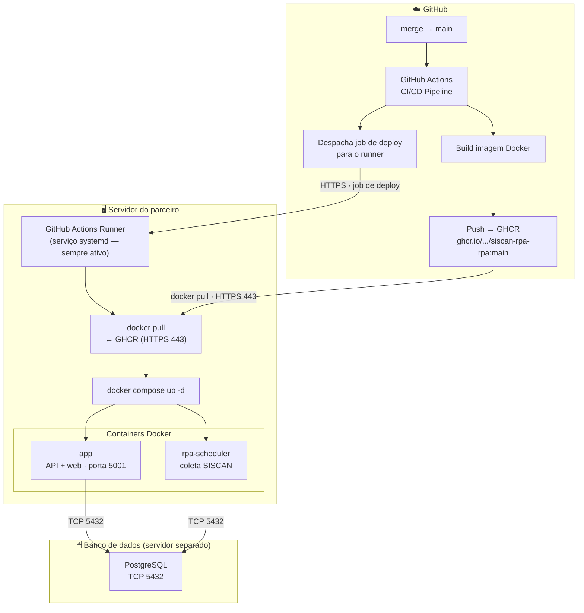

# Guia de Deploy — Modo Servidor (Ubuntu Server)
<a name="deploy-server"></a>

Versão: 1.0
Data: 2026-03-18

Deploy em Ubuntu Server com PostgreSQL externo. O deploy de novas versões é automático via GitHub Actions com self-hosted runner.

---

## Como funciona



**Fluxo resumido:**

1. **Merge para `main`** — um desenvolvedor da Prisma aprova e mescla uma alteração no repositório `siscan-rpa`. Esse evento dispara automaticamente o pipeline de CI/CD no GitHub Actions.

2. **Build e publicação da imagem** — o GitHub Actions compila o código, executa os testes e empacota tudo em uma imagem Docker. Essa imagem é publicada no GitHub Container Registry (GHCR) com a tag `main`, substituindo a versão anterior. O processo ocorre inteiramente na infraestrutura do GitHub — nada é enviado ao servidor do parceiro nesta etapa.

3. **Despacho do job de deploy** — após a publicação da imagem, o mesmo pipeline envia um job de deploy para o runner registrado no servidor do parceiro. Esse job chega via HTTPS e contém apenas instruções — não carrega código-fonte.

4. **Atualização local pelo runner** — o runner, rodando como serviço systemd no servidor, executa dois comandos em sequência:
   - `docker pull ghcr.io/prisma-consultoria/siscan-rpa-rpa:main` — baixa a nova imagem certificada do GHCR.
   - `docker compose -f docker-compose.prd.external-db.yml up -d` — recria os containers com a nova imagem. Containers em execução são substituídos com tempo de inatividade mínimo.

5. **Containers em operação** — `app` (API web, porta 5001) e `rpa-scheduler` (coleta automática do SISCAN) sobem com a versão atualizada e reconectam ao PostgreSQL externo via TCP na porta 5432. O banco de dados não é tocado pelo processo de deploy — apenas a camada de aplicação é substituída.

---

**Sobre tráfego de rede e segurança:**

>  ⚠️  O servidor do parceiro **nunca recebe código-fonte** — apenas a imagem pré-compilada e certificada, produzida e assinada pelo pipeline da Prisma. O único tráfego de **entrada** é o job de deploy enviado pelo GitHub via HTTPS (porta 443); todo o restante é tráfego de **saída** — o runner consulta o GitHub para receber jobs e o Docker baixa a imagem do GHCR. Não é necessário abrir nenhuma porta de entrada no firewall do servidor.

---

## Pré-requisitos

### Servidor de aplicação

| Requisito | Mínimo | Verificação |
|---|---|---|
| Sistema operacional | Ubuntu 24.04 LTS | `lsb_release -a` |
| vCPUs | 4 | `nproc` |
| Memória RAM | 8 GB | `free -h` |
| Disco — artefatos da aplicação | 200 GB (volume dedicado, ex.: `/app`) | `df -h /app` |
| Disco — Docker | 50 GB (volume dedicado, ex.: `/var/lib/docker`) | `df -h /var/lib/docker` |
| Docker Engine | ≥ 28.x (não Docker Desktop) | `docker version` — deve mostrar `Server: Docker Engine` |
| Docker Compose | ≥ 2.37 | `docker compose version` |
| git | qualquer versão recente | `git --version` |
| Conectividade de saída HTTPS | `github.com` e `ghcr.io` porta 443 | `curl -Iv https://github.com` — handshake TLS deve completar. Falha de handshake indica firewall/proxy bloqueando — ver [Problema 3 no TROUBLESHOOTING.md](TROUBLESHOOTING.md#problema-3--falha-tls-ao-conectar-ao-github-handshake-interrompido) |

### Servidor de banco de dados (externo)

| Requisito | Mínimo |
|---|---|
| PostgreSQL | ≥ 16 |
| Conectividade TCP | Porta 5432 acessível pelo servidor de aplicação |

Verificar conectividade antes de prosseguir:

```bash
psql -h <DATABASE_HOST> -U siscan_rpa -c "SELECT version();"
```

### Token de registro do runner

O token é gerado em:
**[GitHub → Prisma-Consultoria/siscan-rpa → Settings → Actions → Runners → New self-hosted runner](https://github.com/Prisma-Consultoria/siscan-rpa/settings/actions/runners/new)**

Na tela que abrir, selecione **Linux**. O token aparece embutido na linha de configuração:

```
./config.sh --url https://github.com/Prisma-Consultoria/siscan-rpa --token <TOKEN>
```

Copie apenas o valor do `--token`. O script pedirá esse valor interativamente na Fase 6.

>  ⚠️  O token expira em poucos minutos. Gere-o imediatamente antes de executar o script.

---

## Instalação (`siscan-server-setup.sh`)

O script executa **uma única vez** de forma interativa. Execute:

```bash
git clone https://github.com/Prisma-Consultoria/assistente-siscan-rpa.git
cd assistente-siscan-rpa
bash ./siscan-server-setup.sh
```

> **O diretório da stack é o próprio diretório onde o repositório foi clonado.** Clone no local desejado (ex.: `/app/assistente-siscan-rpa`, `/opt/siscan-rpa`) — o `.env`, o compose file e os configs ficarão todos lá.

O script percorre 9 fases em sequência. As perguntas interativas e os valores esperados estão na tabela abaixo — detalhes de cada fase na seção [Fases do script](#fases-do-script).

### Respostas esperadas no menu interativo

| Fase | Pergunta | Valor esperado |
|---|---|---|
| 4 | `DATABASE_HOST` | IP ou hostname do PostgreSQL externo (ex.: `192.168.1.10`) |
| 4 | `DATABASE_PASSWORD` | Senha do banco PostgreSQL |
| 4 | `HOST_LOG_DIR` | `/app/siscan-rpa/logs` (ou `/opt/siscan-rpa/logs`) |
| 4 | `HOST_SISCAN_REPORTS_INPUT_DIR` | `/app/siscan-rpa/media/downloads` |
| 4 | `HOST_REPORTS_OUTPUT_CONSOLIDATED_DIR` | `/app/siscan-rpa/media/reports/mamografia/consolidated` |
| 4 | `HOST_REPORTS_OUTPUT_CONSOLIDATED_PDFS_DIR` | `/app/siscan-rpa/media/reports/mamografia/consolidated/laudos` |
| 4 | `HOST_CONFIG_DIR` | `/app/siscan-rpa/config` |
| 6 | `URL do repositório` | `https://github.com/Prisma-Consultoria/siscan-rpa` |
| 6 | `Token de registro` | token copiado da tela do GitHub (ver pré-requisitos) |

> `SECRET_KEY` é gerada automaticamente — não pergunta.

---

## Fases do script

### Sobre o usuário de execução

O GitHub Actions runner **recusa instalação como root** por segurança — ele executa código vindo do GitHub Actions e, se rodasse como root, qualquer workflow poderia comprometer o servidor inteiro. Com um usuário dedicado, o acesso fica isolado.

O script trata isso automaticamente na Fase 2:

- **Executado como root** — o script cria o usuário `siscan`, define a senha interativamente, adiciona ao grupo `docker` e se re-executa como esse usuário. Nenhuma ação manual é necessária.
- **Executado como usuário não-root** — o script confirma o usuário atual e prossegue normalmente.

### Fase 1 — Verificação de pré-requisitos

Verifica se os seguintes componentes estão disponíveis e funcionando:

- **Docker Engine**: checa `docker info` (daemon rodando, usuário com acesso ao socket). Se falhar, o script diagnostica a causa — serviço parado, usuário fora do grupo `docker` ou socket ausente — e exibe o comando correto para resolver.
- **Docker Compose v2** (plugin): checa `docker compose version`.
- **curl**: necessário para baixar o runner.
- **sudo**: necessário para instalar o runner como serviço systemd.

O script **não prossegue** se algum desses itens estiver ausente.

---

### Diagnóstico contínuo via workflow

> **Somente após a Fase 6 (runner instalado e registrado).** Em um servidor novo, o diagnóstico não executa até o runner estar ativo. A primeira coleta ocorre na primeira execução do workflow de CD após o setup completo — seja por um merge para `main` ou via `Run workflow` manual.

Após o setup, cada execução do workflow de CD inclui um **job de diagnóstico** que roda automaticamente no servidor antes do deploy. Ele gera um relatório completo disponível para download em:

**GitHub → siscan-rpa → Actions → run → Artifacts → `diagnostico-servidor-<N>`**

O relatório cobre:

| Verificação | O que é checado |
|---|---|
| `DIR_SISCAN_ASSISTENTE` | Verifica se a variável está definida no ambiente do runner (lida do `~/actions-runner/.env`) e se o diretório existe |
| Usuário e permissões | `whoami`, `id`, permissões do diretório do assistente, `.env` e compose file |
| Sistema operacional | `lsb_release`, CPUs, memória, disco |
| Docker | Versão do Engine e Compose, `daemon.json`, redes existentes e sub-redes |
| Criação de rede | Testa `docker network create` manualmente para confirmar se o daemon consegue criar redes |
| Conectividade HTTPS | `github.com` e `ghcr.io` (necessários para pull do runner e das imagens) |
| Diretórios `HOST_*` | Lê os valores do `.env` e verifica se cada diretório existe e com quais permissões |
| Variáveis obrigatórias | Confirma presença de `SECRET_KEY`, `DATABASE_HOST`, `DATABASE_PASSWORD` etc. sem expor valores |
| Runner | Status do serviço systemd |
| Containers | `docker ps` e imagens siscan disponíveis |

O relatório fica disponível por **7 dias** após cada execução. Use-o para diagnosticar falhas sem precisar de acesso direto ao servidor.

---

### Fase 3 — Verificar arquivos da stack

Verifica que os arquivos necessários estão presentes no diretório do clone:

- **Permissões** — ajusta o dono do diretório para o usuário atual se necessário.
- **`docker-compose.prd.external-db.yml`** — deve existir no repositório clonado. Se ausente, o script falha com instruções para verificar o clone.
- **`config/`** — verifica se o diretório existe e se contém `excel_columns_mapping.json`. Se ausente, cria vazio com aviso.

---

### Fase 4 — Configuração do `.env`

Cria o `.env` a partir do `.env.server.sample`. Em seguida, solicita **interativamente** os valores obrigatórios:

| Variável | O que o script faz |
|---|---|
| `SECRET_KEY` | Gera automaticamente com `openssl rand -hex 32` se estiver vazia |
| `DATABASE_HOST` | Solicita o IP/hostname do PostgreSQL externo; rejeita o valor `db` (inválido neste modo) |
| `DATABASE_PASSWORD` | Solicita a senha; alerta se o valor padrão `siscan_rpa` for detectado |
| `HOST_LOG_DIR` | Solicita o caminho absoluto Linux; alerta se detectar formato Windows |
| `HOST_SISCAN_REPORTS_INPUT_DIR` | Idem |
| `HOST_REPORTS_OUTPUT_CONSOLIDATED_DIR` | Idem |
| `HOST_REPORTS_OUTPUT_CONSOLIDATED_PDFS_DIR` | Idem |
| `HOST_CONFIG_DIR` | Idem |

>  ⚠️  Caminhos com formato Windows (letra de drive, barras invertidas, UNC) são detectados e o script exibe sugestão de caminho Linux equivalente. A seção [Referência de variáveis](#referência-de-variáveis--env) abaixo documenta todos os valores e seus defaults.

---

### Fase 5 — Criação dos diretórios `HOST_*`

Lê os caminhos definidos nas variáveis `HOST_*` do `.env` e executa `mkdir -p` para cada um. Diretórios que já existem são preservados. Variáveis vazias são ignoradas com aviso.

---

### Fase 6 — GitHub Actions Runner

Se o runner ainda não estiver instalado (`~/actions-runner/config.sh` ausente):

1. Detecta a arquitetura do servidor (`x86_64` → `x64`, `aarch64` → `arm64`).
2. Consulta a versão mais recente do runner via API do GitHub.
3. Baixa e extrai o tarball oficial.
4. Solicita interativamente a **URL do repositório** e o **token de registro** (ver [pré-requisitos](#token-de-registro-do-runner)).
5. Registra o runner com label `producao-cliente` e nome `<hostname>-siscan-rpa`.
6. Instala e inicia o runner como **serviço systemd** (via `svc.sh install` + `svc.sh start`).

Se o runner já estiver instalado, verifica se o serviço está ativo e exibe os comandos para iniciar se necessário.

---

### Fase 7 — Permissões Docker

Verifica se o usuário atual pertence ao grupo `docker`. Se não pertencer, executa `sudo usermod -aG docker $USER`.

>  ⚠️  **Atenção:** a mudança de grupo só tem efeito após logout/login na sessão de terminal. O serviço do runner, por ser gerenciado pelo systemd, já inicia com o grupo correto sem necessidade de reiniciar a sessão.

---

### Fase 8 — Persistir `DIR_SISCAN_ASSISTENTE`

O script resolve automaticamente o diretório raiz do assistente (onde o repositório foi clonado) e persiste a variável `DIR_SISCAN_ASSISTENTE` em **três locais**:

| Local | Para quem serve | Sobrevive a reboot? |
|---|---|---|
| `.env` (no diretório do assistente) | `docker compose` — interpola a variável nos compose files | Sim |
| `${RUNNER_DIR}/.env` | Jobs do GitHub Actions (diagnóstico e deploy) | Sim |
| `/etc/environment` | Sessões interativas de qualquer usuário (root, siscan, etc.) | Sim |

Cada parceiro pode clonar o repositório em qualquer caminho (ex.: `/app/assistente-siscan-rpa`, `/opt/siscan-rpa`, `/home/siscan/assistente`). O script detecta o caminho automaticamente e o propaga para os três destinos sem intervenção manual.

>  ⚠️  **Por que o `.env` do runner?** O GitHub Actions runner roda como serviço systemd e **não carrega** `~/.bashrc` nem `/etc/environment`. O único mecanismo para injetar variáveis de ambiente nos jobs é o arquivo `.env` dentro do diretório do runner (`~/actions-runner/.env`). Sem essa entrada, os jobs de diagnóstico e deploy não conseguem localizar o diretório da stack.

Se o runner já estiver instalado mas a variável não estiver configurada (ex.: servidor configurado antes desta atualização), execute manualmente:

```bash
echo 'DIR_SISCAN_ASSISTENTE=/caminho/do/assistente' >> ~/actions-runner/.env
sudo ~/actions-runner/svc.sh stop && sudo ~/actions-runner/svc.sh start
```

---

### Fase 9 — Resumo e próximos passos

Exibe um resumo do que foi configurado (diretórios, compose, `.env`, runner, label, `DIR_SISCAN_ASSISTENTE`) e os próximos passos:

1. Revisar o `.env` no diretório do assistente (ex.: `/app/assistente-siscan-rpa/.env`).
2. Confirmar que o runner aparece como **Idle** em GitHub → Settings → Actions → Runners.
3. Verificar o serviço: `sudo ~/actions-runner/svc.sh status`.
4. O próximo merge para `main` acionará o deploy automaticamente; para acionar manualmente: Actions → CD — Deploy Produção → Run workflow.
5. Acompanhar logs do runner: `journalctl -u actions.runner.*.service -f`.
6. Após o primeiro deploy, acompanhar logs da stack: `cd <DIR_SISCAN_ASSISTENTE> && docker compose -f docker-compose.prd.external-db.yml logs -f`.

---

## Referência de variáveis — `.env`

O `siscan-server-setup.sh` cria o `.env` na fase 4 a partir do `.env.server.sample`. As tabelas de configuração do dia a dia têm as colunas:

- **`.env.server.sample`** — valor sugerido no arquivo de exemplo (caminhos Linux, valores calibrados para servidor dedicado).
- **Default no compose** — fallback declarado com `${VAR:-default}`. Quando diz **`sem fallback`**, a variável não tem valor padrão: o `docker compose up` falha se estiver ausente ou vazia no `.env`.
- **Obrigatória?** — indica se a variável precisa ser explicitamente definida no `.env`.
- **O que faz / Impacto** — comportamento e consequências arquiteturais.

Variáveis que raramente precisam de ajuste (pool de conexões, timeouts, workers, scripts externos e variáveis fixas no compose) estão agrupadas em [Configurações avançadas](#configurações-avançadas).

>  ⚠️  **Credenciais SISCAN** são configuradas pela interface web após o primeiro start: `http://<IP-DO-SERVIDOR>:<HOST_APP_EXTERNAL_PORT>/admin/siscan-credentials`

### Variável de ambiente do assistente

| Variável | Definida por | Onde é persistida | Obrigatória? | O que faz / Impacto |
|---|---|---|---|---|
| `DIR_SISCAN_ASSISTENTE` | `siscan-server-setup.sh` (Fase 8) | `.env` do compose, `.env` do runner, `/etc/environment` | **Sim** | Caminho raiz do repositório `assistente-siscan-rpa` no servidor. Usada pelo workflow de CD (diagnóstico e deploy) para localizar o compose file e o `.env`. Sem ela, o deploy falha. |

>  ℹ️  O valor é resolvido automaticamente pelo `siscan-server-setup.sh` a partir do diretório onde o script foi executado — não precisa ser preenchido manualmente.

### Aplicação HTTP

| Variável | `.env.server.sample` | Default no compose | Obrigatória? | O que faz / Impacto |
|---|---|---|---|---|
| `HOST_APP_EXTERNAL_PORT` | `5001` | `:-5001` | Não | Porta TCP publicada no host. URL de acesso: `http://<IP>:<porta>`. |
| `APP_LOG_LEVEL` | `INFO` | `:-INFO` | Não | Verbosidade dos logs. Use `INFO` em produção; `DEBUG` gera alto volume — somente para diagnóstico. |
| `SECRET_KEY` | *(vazio — preencher)* | sem fallback | **Sim** | Assina cookies de sessão do painel web. A aplicação recusa iniciar sem ela. Gere com `openssl rand -hex 32`. |

### Banco de dados

| Variável | `.env.server.sample` | Default no compose | Obrigatória? | O que faz / Impacto |
|---|---|---|---|---|
| `DATABASE_NAME` | `siscan_rpa` | `:-siscan_rpa` | Não | Nome do banco operacional no PostgreSQL externo. |
| `DATABASE_USER` | `siscan_rpa` | `:-siscan_rpa` | Não | Usuário PostgreSQL da aplicação e das migrations. |
| `DATABASE_PASSWORD` | `siscan_rpa` | `:-siscan_rpa` | Não (**altere em produção**) | Senha do banco. O valor padrão é inseguro — substitua antes do primeiro start. |
| `DATABASE_PORT` | `5432` | `:-5432` | Não | Porta TCP do PostgreSQL externo. |
| `DATABASE_HOST` | *(vazio — preencher)* | **sem fallback** | **Sim** | IP ou hostname do PostgreSQL externo. Sem fallback — o container falha no boot se omitido. Exemplo: `192.168.1.10`. |

### Scheduler batch

| Variável | `.env.server.sample` | Default no compose | Obrigatória? | O que faz / Impacto |
|---|---|---|---|---|
| `CRON_ENABLED` | `true` | `:-true` | Não | Habilita o container `rpa-scheduler`. `false` = container sobe mas executa `sleep infinity` — útil para desabilitar o batch sem remover o serviço. |
| `CRON_INTERVAL_SECONDS` | `1800` | `:-1800` | Não | Intervalo entre ciclos RPA em segundos. `1800` = a cada 30 minutos. |

> ⚠️ **`CRON_ENABLED=false` paralisa completamente o processamento:** nenhum PDF é baixado do SISCAN e nenhum dado é extraído ou persistido no banco. O container `rpa-scheduler` fica ativo mas executa apenas `sleep infinity`. Use `false` somente para manutenção pontual e retorne para `true` imediatamente após.

Para `RPA_MAX_ATTEMPTS` e `RPA_BACKOFF_SECONDS` (retentativas e backoff exponencial), consulte [Configurações avançadas](#configurações-avançadas).

### Persistência no host — bind mounts

Diretórios do servidor montados nos containers. **Sem eles o `docker compose up` falha.** O `siscan-server-setup.sh` cria esses diretórios na fase 5 a partir dos valores definidos no `.env`.

| Variável | `.env.server.sample` | Default no compose | Obrigatória? | O que faz |
|---|---|---|---|---|
| `HOST_LOG_DIR` | `/opt/siscan-rpa/logs` | sem fallback | **Sim** | Logs da aplicação e do scheduler. Inclua na rotina de backup. |
| `HOST_SISCAN_REPORTS_INPUT_DIR` | `/opt/siscan-rpa/media/downloads` | sem fallback | **Sim** | PDFs baixados do SISCAN. Entrada do pipeline `processar_laudos`. |
| `HOST_REPORTS_OUTPUT_CONSOLIDATED_DIR` | `/opt/siscan-rpa/media/reports/mamografia/consolidated` | sem fallback | **Sim** | Artefatos consolidados (`.xlsx`, `.parquet`). |
| `HOST_REPORTS_OUTPUT_CONSOLIDATED_PDFS_DIR` | `/opt/siscan-rpa/media/reports/mamografia/consolidated/laudos` | sem fallback | **Sim** | PDFs individuais por laudo, em subpastas por status (`liberado/`, `comresultado/`, etc.). |
| `HOST_CONFIG_DIR` | `/opt/siscan-rpa/config` | sem fallback | **Sim** | Configurações externas. Deve conter `excel_columns_mapping.json`. |
| `HOST_BACKUPS_DIR` | `/opt/siscan-rpa/backups` | `:-./backups` | Não | Destino dos backups PostgreSQL gerados por `backup_manager.sh`. |

Estrutura de diretórios resultante no servidor (caminhos sugeridos para `/opt/siscan-rpa/`):

```
/opt/siscan-rpa/
├── .env                                                  ← configuração da stack
├── docker-compose.prd.external-db.yml                   ← orquestração dos containers
│
├── logs/                                                 ← HOST_LOG_DIR
├── config/                                               ← HOST_CONFIG_DIR
│   └── excel_columns_mapping.json
├── media/
│   ├── downloads/                                        ← HOST_SISCAN_REPORTS_INPUT_DIR
│   └── reports/
│       └── mamografia/
│           └── consolidated/                             ← HOST_REPORTS_OUTPUT_CONSOLIDATED_DIR
│               ├── laudos/                               ← HOST_REPORTS_OUTPUT_CONSOLIDATED_PDFS_DIR
│               │   ├── liberado/
│               │   ├── comresultado/
│               │   └── ...
│               └── *.xlsx / *.parquet
├── scripts/
│   └── clients/                                          ← HOST_SCRIPTS_CLIENTS
└── backups/                                              ← HOST_BACKUPS_DIR
```

### Opcional

Consulte o documento de referência: [**ENV_REFERENCE.md — Opcional**](https://github.com/Prisma-Consultoria/siscan-rpa/blob/main/docs/ENV_REFERENCE.md#opcional).

### Configurações avançadas

Variáveis que raramente precisam de ajuste em produção normal (concorrência de workers, pool de conexões SQLAlchemy, timeouts Playwright, scripts externos e variáveis com valor fixo no compose). Consulte o documento de referência: [**ENV_REFERENCE.md — Configurações avançadas**](https://github.com/Prisma-Consultoria/siscan-rpa/blob/main/docs/ENV_REFERENCE.md#configurações-avançadas).

---

## Primeiro acesso

1. Abrir o navegador em `http://<IP-DO-SERVIDOR>:<HOST_APP_EXTERNAL_PORT>` (padrão porta 5001).
2. Navegar até `/admin/siscan-credentials` e cadastrar usuário/senha do SISCAN.
3. O runner registrado na fase 6 receberá automaticamente os próximos deploys via GitHub Actions.

---

## Comandos úteis

```bash
# Status dos containers
docker compose -f docker-compose.prd.external-db.yml ps

# Logs em tempo real
docker compose -f docker-compose.prd.external-db.yml logs -f

# Testar health endpoint
curl -s http://localhost:5001/health | python3 -m json.tool

# Status do runner
cd ~/actions-runner && ./svc.sh status
```

Referência completa do pipeline de deploy: [DEPLOY_AUTOMATICO.md](https://github.com/Prisma-Consultoria/siscan-rpa/blob/main/docs/DEPLOY_AUTOMATICO.md) — Opção 1.A Self-hosted Runner.
